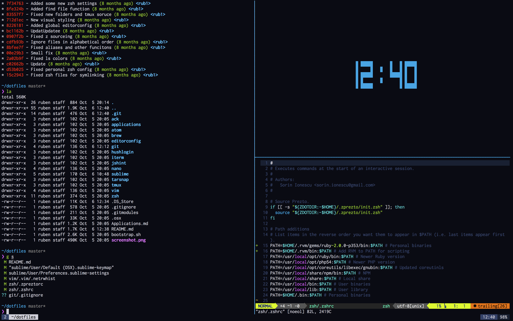
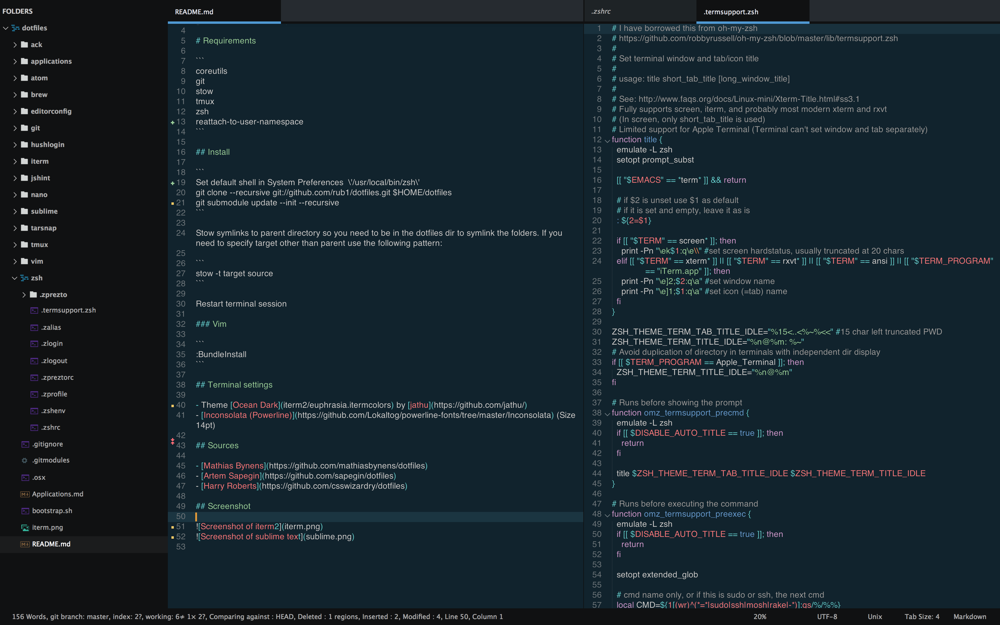

# dotfiles

My start for getting some awesome dotfiles. My startingpoint ~~is~~ was mostly a fork of [Mathias Bynens'](https://github.com/mathiasbynens/dotfiles) bash files witch I've now stopped using since I've gone over to use Zsh. My Vim config ~~is~~ was a fork of [Harry Roberts'](https://github.com/csswizardry/dotfiles) vimrc for a startingpoint. Go check them out they're both awesome. My Sublime config have been evolving over the past few years and i tend to switch color scheme atleast once a month. Can't remember where I forked my tmux.conf, sorry. Copyed tmux styling from [xero](https://github.com/xero/dotfiles).

# Requirements

```
coreutils
git
stow
tmux
zsh
reattach-to-user-namespace
```

## Install

``` 
Set default shell in System Preferences  \'/usr/local/bin/zsh\'
git clone --recursive git://github.com/rub1/dotfiles.git $HOME/dotfiles
git submodule update --init --recursive
```

Stow symlinks to parent directory so you need to be in the dotfiles dir to symlink the folders. If you need to specify target other than parent use the following pattern:

```
stow -t target source
```

Restart terminal session

### Vim

``` 
:BundleInstall
```

## Terminal settings

- Theme [Ocean Dark](iterm2/euphrasia.itermcolors) by [jathu](https://github.com/jathu/)
- [Inconsolata (Powerline)](https://github.com/Lokaltog/powerline-fonts/tree/master/Inconsolata) (Size 14pt)

## Sources

- [Mathias Bynens](https://github.com/mathiasbynens/dotfiles) 
- [Artem Sapegin](https://github.com/sapegin/dotfiles)
- [Harry Roberts](https://github.com/csswizardry/dotfiles)

## Screenshot



